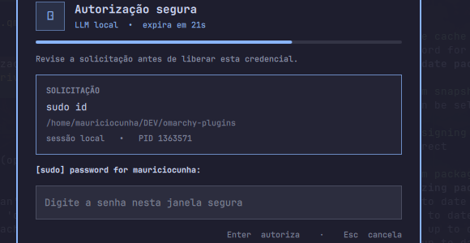

> **Note (pre-extraction draft):** this README is written for Doorman's
> planned standalone repository (see `docs/decisions/0002-rename-to-doorman.md`
> in the monorepo). Paths like `broker/`, `packaging/`, and `scripts/` are
> relative to that future repo root, not to this directory's current location
> inside `omarchy-plugins`. Delete this note once the extraction happens.

# Doorman

**Local, human-approved `sudo` for background AI agents.**

Doorman is an [Omarchy](https://omarchy.org) plugin for people who run coding
agents (Claude Code, Codex, or anything else that can drive a shell) in
background sessions they aren't watching. When one of those agents needs
`sudo`, there's usually no terminal in front of you to type a password into —
and handing the agent your password so it can type it itself defeats the
point of having one. Doorman puts a human decision in between: the agent's
request shows up in a small, local, keyboard-first window only you can see,
and the password never travels anywhere else — not to the agent, not to the
chat transcript, not to a log file.



## Why this exists

Agentic coding tools are increasingly good at running real commands, and
real commands sometimes need root. The usual answers are all
unsatisfying for local dev work:

- **Give the agent passwordless `sudo`** — fast, but now anything the agent
  runs (including a bug in the agent, or a prompt injection from something
  it read) has unrestricted root.
- **Type the password into the agent's own prompt** — the agent (and
  whatever logs its transcript) now has your password.
- **Babysit every session with a visible terminal** — defeats the purpose of
  running things in the background.

Doorman decouples *where a command asks for a password* from *where you type
it*. The requesting process calls the standard `sudo askpass` protocol; a
small local broker holds the request open and shows it to you; you type the
password into a window the agent has no access to; only that specific,
already-decided-and-verified process gets the secret, once, and only through
that broker connection. If you don't respond, or you're not the person who
actually ran the command, or you hit Escape — it fails closed.

## How it works

```
requesting process (sudo -A)
        │
        ▼
   askpass helper  ──(local Unix socket, token + capability)──►  broker
                                                                      │
                                                       shows the request in
                                                             a Quickshell modal
                                                                      │
                                                              you approve / cancel
                                                                      │
        ◄──────────────────────── secret, once ───────────────────────┘
```

- The **broker** is a small Python service that owns a private Unix socket
  (`0600`, under a `0700` runtime directory). It never writes the secret to
  disk, a log, or its own stdout.
- Every request carries a random `request_id` and a high-entropy `nonce`,
  expires in 1–300 seconds, and can be consumed exactly once. The broker
  re-validates the requesting process's PID, UID, start time, and command
  line at the moment of approval — not just when the request was created —
  so a PID that's been reused or a process whose identity changed can't
  slip through.
- The **UI** is a Quickshell overlay: a topbar widget for status/history, and
  a modal that grabs keyboard focus, shows exactly what's being authorized
  (command, working directory, PID, terminal), counts down the time left to
  decide, and sends a desktop notification if you're looking at a different
  monitor.
- Approving, cancelling, or letting a request expire are the only three
  outcomes. There is no fourth path where the secret leaks sideways.

See [`SPEC.md`](SPEC.md) for the full protocol, threat model, and the
reasoning behind each security property — including the DoS and timing bugs
we found and fixed while building this.

## Installing

Doorman has two parts: the **broker**, a `systemd --user` service, and the
**plugin**, an Omarchy bar widget.

```bash
# 1. Install the plugin (adjust the target path/id to match your Omarchy setup)
cp -r . ~/.config/omarchy/plugins/mauricio.doorman

# 2. Install and enable the broker service
cp packaging/omarchy-doorman.service ~/.config/systemd/user/
systemctl --user daemon-reload
systemctl --user enable --now omarchy-doorman.service

# 3. Reload Omarchy's shell so it picks up the new widget
omarchy-restart-shell

# 4. Shadow `sudo` for this user so agents pick it up without any
#    per-agent configuration — see "Wiring up sudo" below for why this
#    step is the one that actually makes Doorman useful.
ln -s "$(pwd)/scripts/doorman-sudo" ~/.local/bin/sudo
```

Nothing here touches `/usr/share/omarchy/`, replaces `/usr/bin/sudo`, or edits
`sudoers`. Both steps are explicit and reversible: stop the service and
delete the plugin directory to remove it completely.

### Wiring up `sudo`

The whole point of Doorman is that an agent shouldn't need to know it
exists. If it only intercepts `sudo` calls that were deliberately routed
through a wrapper, it's back to being a personal habit, not something that
protects anyone who installs it from the catalog without also editing every
agent's own instructions.

`sudo` itself won't cooperate here: given a real terminal to prompt on, it
prefers that terminal over `SUDO_ASKPASS` regardless of what's in the
environment — `-A` has to be passed explicitly, every time, by whatever
calls `sudo`. Since agents (and plain scripts) almost always resolve `sudo`
by name rather than by absolute path, the fix is to make sure they resolve
*Doorman's* `sudo` first:

```bash
# Recommended: shadow `sudo` for this user's own shells only.
# ~/.local/bin generally precedes /usr/bin in PATH already (Omarchy ships
# this by default); this does not touch /usr/bin/sudo, sudoers, or any
# other user's environment.
ln -s "$(pwd)/scripts/doorman-sudo" ~/.local/bin/sudo
```

With that in place, plain `sudo <command>` — typed by you, or run by an
agent in a background job or a terminal it opened itself — resolves to the
wrapper, which always forwards to the real `sudo -A` unless the caller
already passed `-A`/`-S`/`-n`/`--stdin`/`--non-interactive` explicitly. The
one thing this can't catch is a caller that hardcodes `/usr/bin/sudo` by
absolute path, bypassing `PATH` resolution entirely — see
[`SPEC.md`](SPEC.md#7-known-limitations).

Other integration points still exist for narrower cases:

```bash
# One-off, for a single external command, without shadowing sudo at all:
scripts/doorman-run -- sudo systemctl restart some-service

# Or point SUDO_ASKPASS at the plugin's askpass helper directly, the way
# a real `sudo -A` invocation (or an agent's own shell) would:
export SUDO_ASKPASS=~/.config/omarchy/plugins/mauricio.doorman/askpass.py
sudo -A whoami
```

## What Doorman is not

- Not a secrets vault, and not a password manager. It relays one password,
  once, to one already-verified process.
- Not a keylogger-proofing tool, a sandbox, or a replacement for `sudoers`
  policy — it's a human-in-the-loop gate in front of the normal `sudo`
  mechanism.
- Not (yet) audited by anyone other than the people who built it. See the
  status note below before trusting it with anything that matters.

## Project status

Doorman is in **private beta**: solid enough for the exact workflow it was
built for (local dev machine, one user, background coding agents), not yet
reviewed by anyone outside the project. Current gaps before a wider release:

- No `qmllint`/CI pipeline yet — checks run manually (see below).
- No test coverage against a real Quickshell/Omarchy session or real `sudo`,
  only against the broker's own protocol.
- Threat model and plugin lifecycle haven't had an independent review.

None of that changes what's already true today: the secret never leaves the
approval path, every request is single-use and identity-checked, and the
broker fails closed on anything it can't verify.

## Development

```bash
python3 -m unittest discover -s tests -p 'test_*.py'
python3 -m py_compile broker/*.py *.py
git diff --check
```

The test suite covers authentication, invalid origin, missing/mismatched
PID, expiry, approval, replay, wrong nonce, cancellation, the askpass helper,
process-identity changes, the idle-connection DoS fix, and the concurrent-
request cap. See [`SPEC.md`](SPEC.md#acceptance-criteria) for the full list
mapped to requirements.

## License

MIT. See [`LICENSE`](LICENSE).
